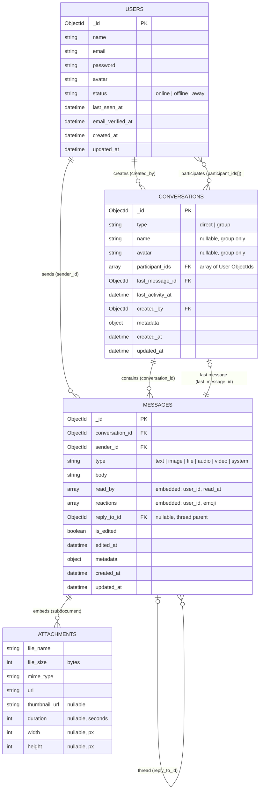
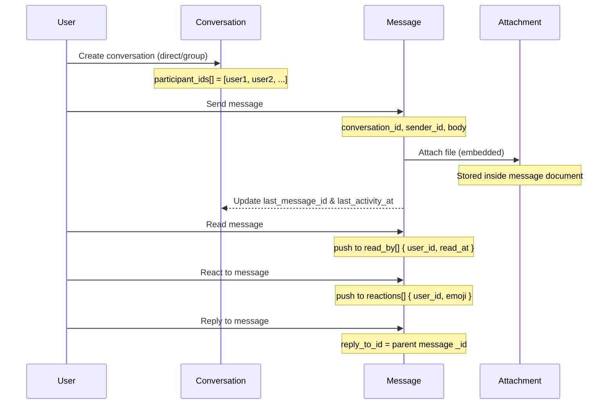

# Telefon — MongoDB Database Schema

## Entity Relationship Diagram



## Collections Overview

### `users`
Standard auth collection. Each user can participate in many conversations and send many messages.

### `conversations`
Represents either a **direct** (1-to-1) or **group** chat. Participants are stored as an embedded array of User ObjectIds — no pivot collection needed.

### `messages`
Each message belongs to one conversation and one sender. Supports:
- **Threading** — `reply_to_id` points to a parent message
- **Read receipts** — `read_by[]` array of `{ user_id, read_at }`
- **Reactions** — `reactions[]` array of `{ user_id, emoji }`

### `attachments` *(embedded, not a collection)*
Stored **inside** each message document via `embedsMany`. Not a standalone collection — fetched automatically with the parent message.

---

## Data Flow



## Example Documents

### Conversation
```json
{
  "_id": "662a1b...",
  "type": "group",
  "name": "Project Team",
  "avatar": null,
  "participant_ids": ["661f0a...", "661f0b...", "661f0c..."],
  "last_message_id": "662b3c...",
  "last_activity_at": "2026-04-18T15:00:00Z",
  "created_by": "661f0a...",
  "metadata": {}
}
```

### Message (with embedded attachment)
```json
{
  "_id": "662b3c...",
  "conversation_id": "662a1b...",
  "sender_id": "661f0a...",
  "type": "image",
  "body": "Check this out!",
  "attachments": [
    {
      "file_name": "photo.jpg",
      "file_size": 245000,
      "mime_type": "image/jpeg",
      "url": "/storage/attachments/photo.jpg",
      "thumbnail_url": "/storage/attachments/photo_thumb.jpg",
      "width": 1920,
      "height": 1080
    }
  ],
  "read_by": [
    { "user_id": "661f0b...", "read_at": "2026-04-18T15:01:00Z" }
  ],
  "reactions": [
    { "user_id": "661f0b...", "emoji": "👍" }
  ],
  "reply_to_id": null,
  "is_edited": false,
  "edited_at": null,
  "metadata": {}
}
```
