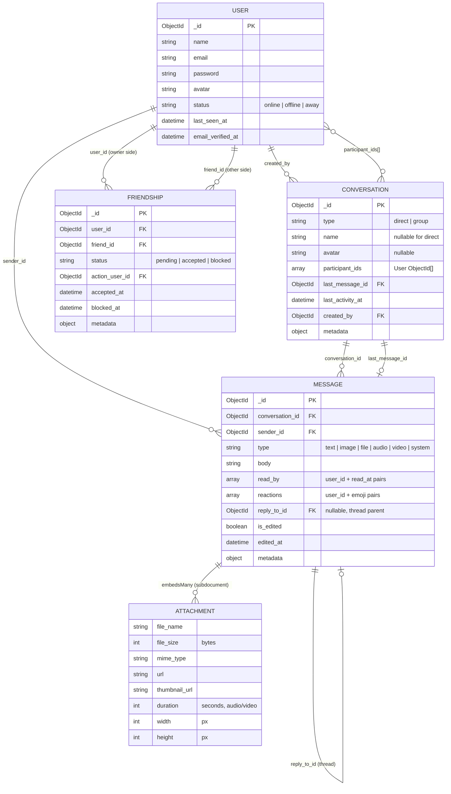
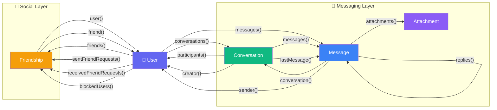

# Telefon — Full Database Relationship Diagram

## Entity Relationship Diagram



---

## Model Connections Overview



---

## Function Cheatsheet

### 🤝 Friendship — Static Methods (call on the class)

| Action | Code | What it does |
|--------|------|-------------|
| **Send request** | `Friendship::sendRequest($myId, $theirId)` | Creates 1 pending doc |
| **Accept request** | `Friendship::acceptRequest($myId, $senderId)` | Updates to accepted + creates reciprocal doc |
| **Reject request** | `Friendship::rejectRequest($myId, $senderId)` | Deletes the pending doc |
| **Remove friend** | `Friendship::removeFriend($myId, $theirId)` | Deletes both accepted docs |
| **Block user** | `Friendship::blockUser($myId, $theirId)` | Removes everything, creates 1 blocked doc |
| **Unblock user** | `Friendship::unblockUser($myId, $theirId)` | Deletes the blocked doc |
| **Are friends?** | `Friendship::areFriends($a, $b)` | Returns `bool` |
| **Has blocked?** | `Friendship::hasBlocked($blocker, $blocked)` | Returns `bool` |

### 👤 User — Instance Methods (call on a `$user`)

| Action | Code | Returns |
|--------|------|---------|
| **My friends** | `$user->friends` | Collection of `Friendship` (use `->friend` for User) |
| **Requests I sent** | `$user->sentFriendRequests` | Collection of pending `Friendship` |
| **Requests I received** | `$user->receivedFriendRequests` | Collection of pending `Friendship` |
| **Users I blocked** | `$user->blockedUsers` | Collection of blocked `Friendship` |
| **Am I friends with X?** | `$user->isFriendWith($id)` | `bool` |
| **Did I block X?** | `$user->hasBlocked($id)` | `bool` |
| **Did X block me?** | `$user->isBlockedBy($id)` | `bool` |
| **My conversations** | `$user->conversations()` | Collection of `Conversation` |
| **My messages** | `$user->messages` | Collection of `Message` |

### 💬 Conversation — Instance Methods

| Action | Code | Returns |
|--------|------|---------|
| **All messages** | `$convo->messages` | Collection of `Message` |
| **Last message** | `$convo->lastMessage` | `Message` |
| **Participants** | `$convo->participants()` | Collection of `User` |
| **Creator** | `$convo->creator` | `User` |
| **Add participant** | `$convo->addParticipant($userId)` | `void` |
| **Remove participant** | `$convo->removeParticipant($userId)` | `void` |
| **Has participant?** | `$convo->hasParticipant($userId)` | `bool` |
| **Only direct chats** | `Conversation::direct()->get()` | Scope |
| **Only groups** | `Conversation::group()->get()` | Scope |
| **User's convos** | `Conversation::forUser($id)->get()` | Scope |

### 📨 Message — Instance Methods

| Action | Code | Returns |
|--------|------|---------|
| **Its conversation** | `$msg->conversation` | `Conversation` |
| **Who sent it** | `$msg->sender` | `User` |
| **Parent message** | `$msg->replyTo` | `Message` or null |
| **Thread replies** | `$msg->replies` | Collection of `Message` |
| **Attachments** | `$msg->attachments` | Collection of `Attachment` |
| **Mark as read** | `$msg->markReadBy($userId)` | `void` |
| **Is read by X?** | `$msg->isReadBy($userId)` | `bool` |
| **Add reaction** | `$msg->addReaction($userId, '👍')` | `void` |
| **Remove reaction** | `$msg->removeReaction($userId)` | `void` |

### 📎 Attachment — Instance Methods

| Action | Code | Returns |
|--------|------|---------|
| **Is image?** | `$att->isImage()` | `bool` |
| **Is video?** | `$att->isVideo()` | `bool` |
| **Is audio?** | `$att->isAudio()` | `bool` |
| **Readable size** | `$att->humanFileSize()` | `string` e.g. "2.5 MB" |

---

## Common Usage Patterns

### Send a friend request then start chatting after acceptance
```php
// 1. Alice sends friend request
Friendship::sendRequest($alice->_id, $bob->_id);

// 2. Bob accepts
Friendship::acceptRequest($bob->_id, $alice->_id);

// 3. Now create a direct conversation
$convo = Conversation::create([
    'type'            => 'direct',
    'participant_ids' => [$alice->_id, $bob->_id],
    'created_by'      => $alice->_id,
    'last_activity_at' => now(),
]);

// 4. Alice sends a message
$message = Message::create([
    'conversation_id' => $convo->_id,
    'sender_id'       => $alice->_id,
    'type'            => 'text',
    'body'            => 'Hey Bob! 👋',
]);

// 5. Update conversation's last message
$convo->update([
    'last_message_id'  => $message->_id,
    'last_activity_at' => now(),
]);
```

### Check friendship before allowing message
```php
if ($user->isFriendWith($recipientId) && !$user->isBlockedBy($recipientId)) {
    // allow messaging
}
```
