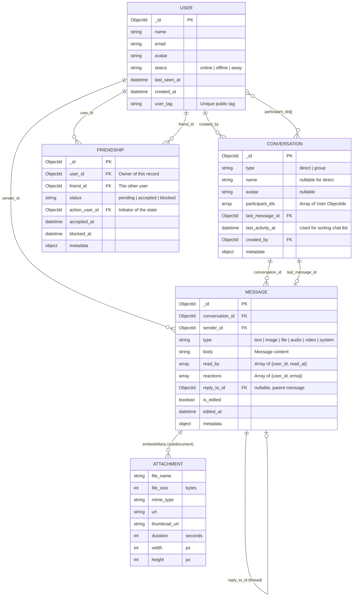

# SanCo - Full Database Relationship Diagram

## Entity Relationship Diagram

---

## Model Relationships & Functions

### User Model (`app/Models/User.php`)

| Method | Description |
| :--- | :--- |
| `conversations()` | Gets all conversations where the user's ID is in `participant_ids`. |
| `messages()` | Gets all messages sent by this user (1:N). |
| `friendships()` | Returns all friendship records owned by the user. |
| `friends()` | Returns only **accepted** friendship records. |
| `sentFriendRequests()` | Returns friendship records initiated by the user that are still `pending`. |
| `receivedFriendRequests()` | Returns friendship records where the user is the target and status is `pending`. |
| `blockedUsers()` | Returns friendship records where the user has blocked others. |
| `isFriendWith($id)` | Checks if a mutual accepted friendship exists with `$id`. |
| `hasBlocked($id)` | Checks if the current user has blocked the user with `$id`. |
| `isBlockedBy($id)` | Checks if the user with `$id` has blocked the current user. |

### Conversation Model (`app/Models/Conversation.php`)

| Method | Description |
| :--- | :--- |
| `messages()` | Relationship to all messages in the conversation. |
| `lastMessage()` | Relationship to the singular most recent message. |
| `participants()` | Fetches actual `User` models for every ID in `participant_ids`. |
| `creator()` | Relationship to the user who created the group/chat. |
| `addParticipant($id)` | Pushes a new User ID into the `participant_ids` array. |
| `removeParticipant($id)`| Pulls a User ID from the `participant_ids` array. |
| `getDisplayInfo()` | Logic that determines the chat name/avatar (Self, Direct, or Group). |
| **Static** `findOrCreateDirect($a, $b)` | Orchestrates the creation or retrieval of a 1-on-1 chat room. |
| **Static** `getInboxFor($user)` | Returns a list of conversations for the user, including the 'Display Info' (Name/Avatar) pre-calculated. |

### Message Model (`app/Models/Message.php`)

| Method | Description |
| :--- | :--- |
| `conversation()` | Parent relationship to the Conversation. |
| `sender()` | Relationship to the User who sent the message. |
| `replyTo()` | Relationship to the parent message if this is a reply. |
| `replies()` | Relationship to all messages replying to this one. |
| `attachments()` | Accessor for sub-document attachments (images/files). |
| `markReadBy($userId)` | Adds the user to the `read_by` array with a timestamp. |
| `isReadBy($userId)` | Checks if a specific user has viewed this message. |
| `addReaction($id, $emoji)` | Adds/Updates an emoji reaction in the `reactions` array. |
| `getMessages($conversationId, $loadLimit=20)` | Loads `messages` in the conversation. With a message load limit of 20 with paginate built-in function. |

### Friendship Model (`app/Models/Friendship.php`)

| Method | Description |
| :--- | :--- |
| **Static** `sendRequest($a, $b)` | Creates a new `pending` record. |
| **Static** `acceptRequest($me, $sender)` | Marks original as `accepted` and creates a reciprocal record. |
| **Static** `removeFriend($a, $b)` | Deletes **both** reciprocal records (Unfriend). |
| **Static** `blockUser($me, $them)` | Deletes friendships and creates a singular `blocked` record. |
| **Static** `areFriends($a, $b)` | Verifies if an accepted record exists between two users. |

---

## Database Architecture Overview

### MongoDB Specifics
- **Eloquent-Compatible**: We use the `mongodb/laravel-mongodb` package, allowing us to use standard Laravel relationships (`hasMany`, `belongsTo`) while benefiting from MongoDB's flexible schema.
- **Embedded Arrays**: Instead of complex pivot tables for "Participant Lists" or "Read Receipts", we use arrays (`participant_ids`, `read_by`). This is significantly faster in NoSQL.
- **Atomic Operations**: We use `$push` and `$pull` for adding/removing items from arrays to ensure data integrity without refreshing the entire document.

### The Symmetric Friendship System
To ensure both Alice and Bob can see each other in their "Friends" list with high performance, we use a **reciprocal document** pattern:
1. Alice accepts Bob's request.
2. Doc 1: `user_id: Alice, friend_id: Bob, status: accepted`
3. Doc 2: `user_id: Bob, friend_id: Alice, status: accepted`
This allows us to query `Friendship::where('user_id', auth()->id())->where('status', 'accepted')` and get a simple list of friends instantly.
